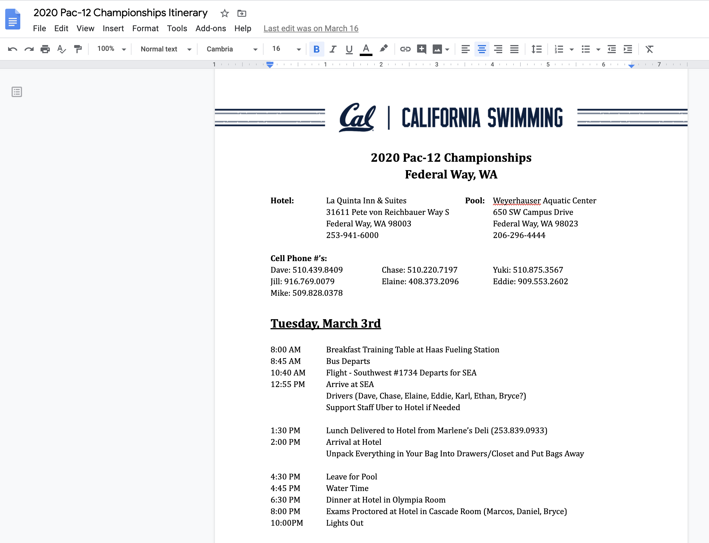
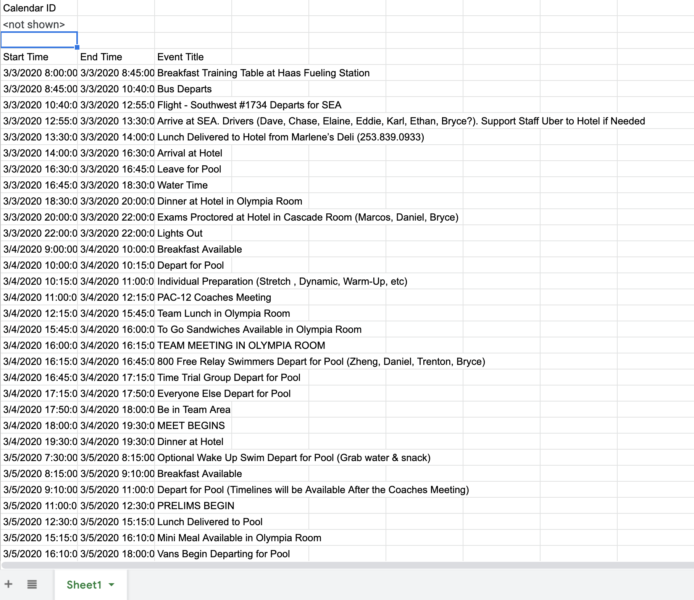
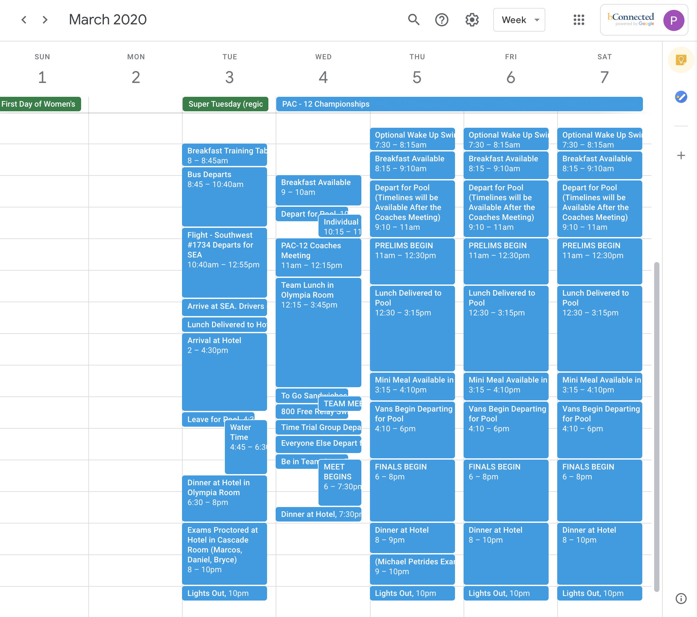

# Itin2Cal
Reads all events from an Itinerary in Google Docs and adds them to a Google Calendar!

Just enter the name of your itinerary, and Itin2Cal will do the rest! This program uses Google Drive API, Google Sheets API, and Google Apps Script.

First Page of an Itinerary

Events Inserted into a Spreadsheet using Lexicographical Analysis

Events Inserted into Calendar, To Never Forget An Event!
